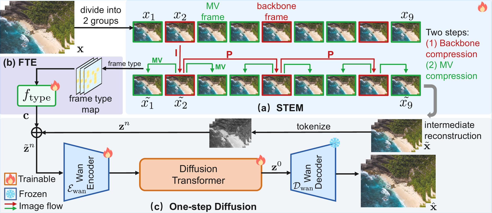
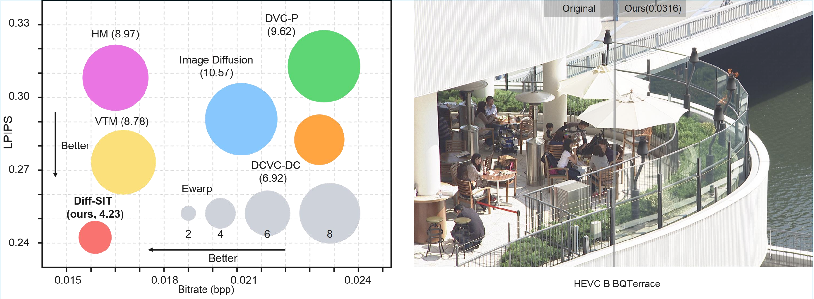
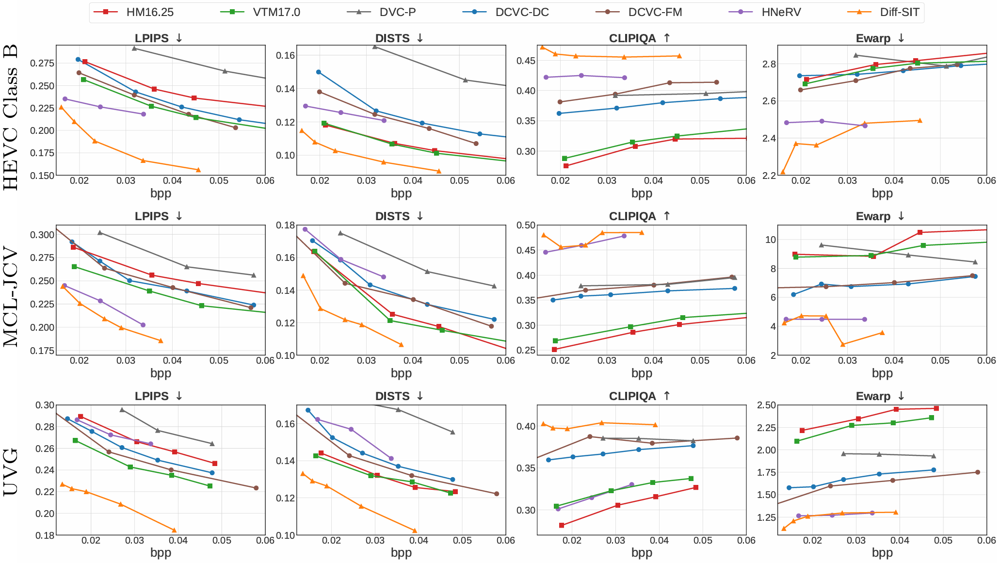
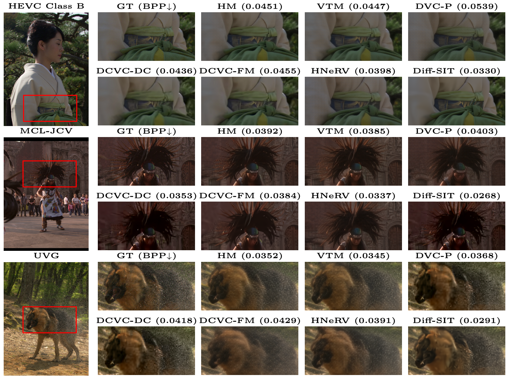
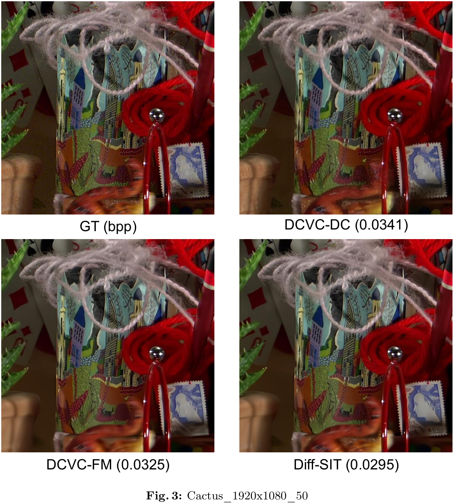
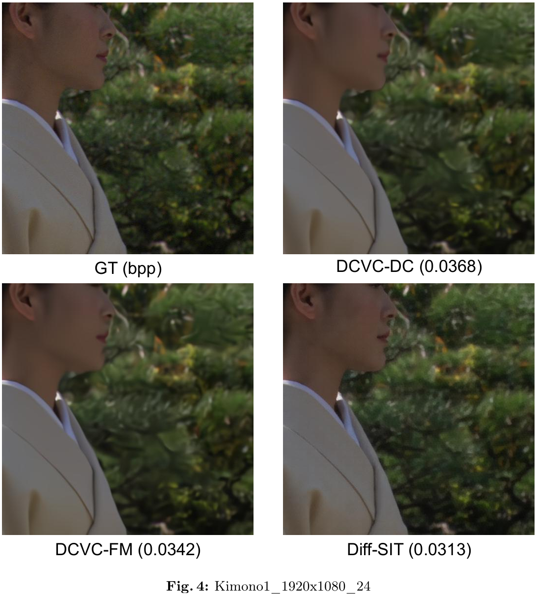
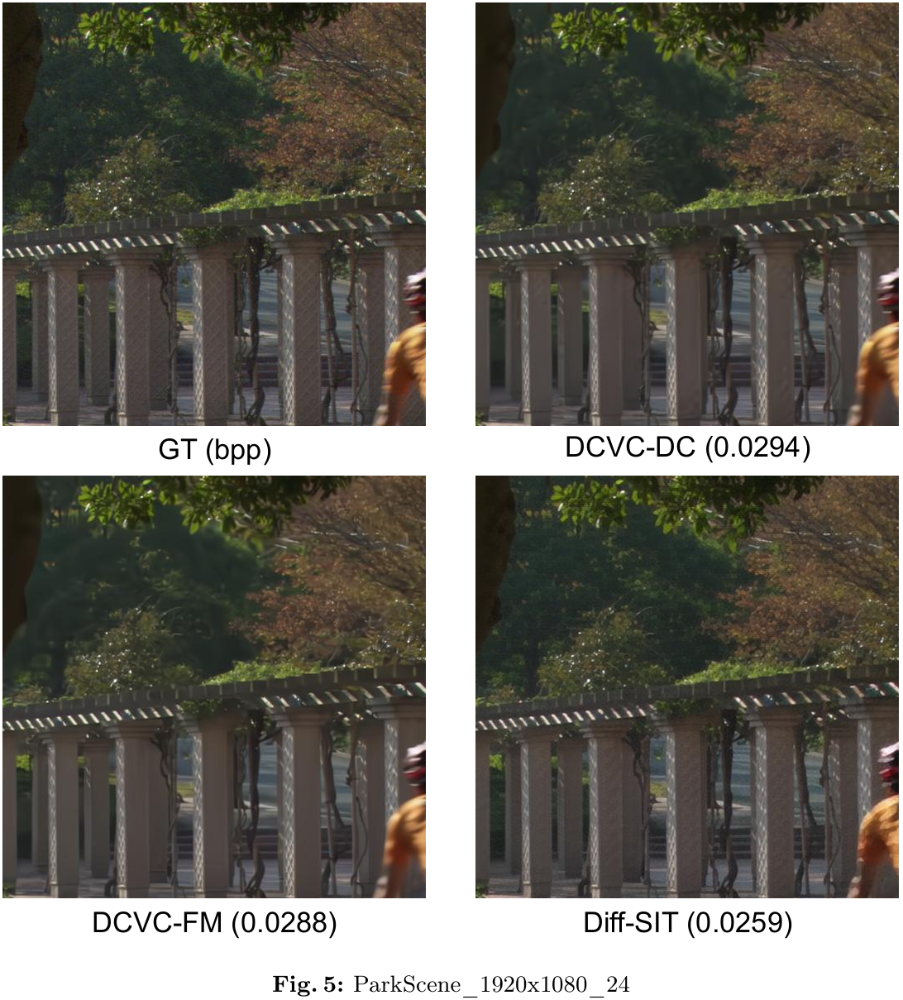

# Efficient Video Diffusion with Sparse Information Transmission for Video Compression
[Mingde Zhou](https://orcid.org/0009-0003-6642-7349), [Zheng Chen](https://zheng-chen.cn), and [Yulun Zhang](http://yulunzhang.com/), "Efficient Video Diffusion with Sparse Information Transmission for Video Compression"

<div>
<a href="https://github.com/MingdeZhou/Diff-SIT/releases/tag/v1.0" target='_blank' style="text-decoration: none;"></a>
<a href="https://github.com/MingdeZhou/Diff-SIT" target='_blank' style="text-decoration: none;"></a>
<a href="https://github.com/MingdeZhou/Diff-SIT" target='_blank' style="text-decoration: none;"></a>
</div>


[[project]()] [[arXiv]()] [[supplementary material](https://github.com/MingdeZhou/Diff-SIT/releases/download/v1.0/Supplementary_Material.pdf)] [dataset] [pretrained models]


#### 🔥🔥🔥 News

- **2026-3-16:** This repo is released.

---

> **Abstract:** Video compression aims to maximize reconstruction quality with minimal bitrates. Beyond standard distortion metrics, perceptual quality and temporal consistency are also critical. However, at ultra-low bitrates, traditional end-to-end compression models tend to produce blurry images of poor perceptual quality. Besides, existing generative compression methods often treat video frames independently and show limitations in time coherence and efficiency. To address these challenges, we propose the Efficient Video **Diff**usion with **S**parse **I**nformation **T**ransmission (Diff-SIT), which comprises the Sparse Temporal Encoding Module (STEM) and the One-Step Video Diffusion with Frame Type Embedder (ODFTE). The STEM sparsely encodes the original frame sequence into an information-rich intermediate sequence, achieving significant bitrate savings. Subsequently, the ODFTE processes this intermediate sequence as a whole, which exploits the temporal correlation. During this process, our proposed Frame Type Embedder (FTE) guides the diffusion model to perform adaptive reconstruction according to different frame types to optimize the overall quality. Extensive experiments demonstrate that Diff-SIT establishes a new state-of-the-art in perceptual quality and temporal consistency, particularly in the challenging ultra-low-bitrate regime.


### Pipeline



---

### Performance



## 🔖 TODO

- [ ] Release testing and training code.
- [ ] Release pre-trained models.
- [ ] Provide HuggingFace demo.

## 🔗 Contents

1. Datasets
1. Models
1. Training
1. Testing
1. [Results](#results)
1. [Acknowledgements](#acknowledgements)

## <a name="results"></a>🔎 Results

We achieve impressive performance on image compression tasks.

<details open>
<summary>Quantitative Results (click to expand)</summary>

- Results in Fig. 5 of the main paper

<p align="center">
  
</p>
</details>

<details open>
<summary>Qualitative Results (click to expand)</summary>

- Results in Fig. 6 of the main paper

<p align="center">
  
</p>
<details>
<summary>More Qualitative Results</summary>

Additional visual results (Fig. 3, 4, 5 in supplementary material)

<p align="center">
  
</p>

<p align="center">
  
</p>

<p align="center">
  
</p>


</details>

</details>

## <a name="citation"></a>📎 Citation

If you find the code helpful in your research or work, please cite the following paper(s).

```

```

## <a name="acknowledgements"></a>💡 Acknowledgements

This project is based on [DCVC series](https://github.com/microsoft/DCVC) and [Wan](https://github.com/Wan-Video/Wan2.1).

